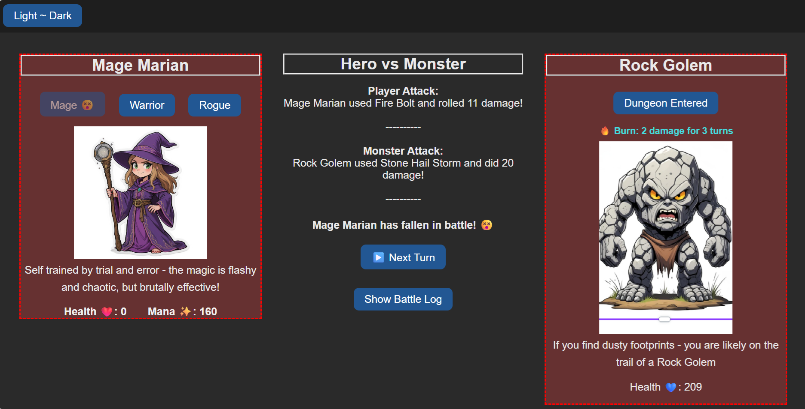

## Hero vs Monster mini-game
---
## Objective / Purpose

A turn-based RPG-style mini-game where the player selects a hero and battles randomly generated monsters. The game showcases turn logic, status effects, resource management (health & mana), and dynamic UI updates using vanilla JavaScript.

## Technologies Used

- HTML5
- CSS3
- JavaScript (Vanilla)
- VS Code
- Git & GitHub

## Setup / Installation

To run the game locally:

- Clone the repo:
- git clone https://github.com/PinkIgloo/hero-vs-monster.git

Open index.html in your browser  
Play the game using the on-screen buttons!

## Features & Functionality

- Select from 3 unique heroes: Mage, Warrior, and Rogue
- Each hero has custom attacks and associated mana costs
- Monsters are randomly chosen with unique attacks
- Health and mana dynamically update on screen
- Status effects apply (e.g., Burn, Confused) and will be extended in the next update
- Hero buttons disable when a character falls
- Victory and defeat states with a game reset option

## Results / Screenshots

## Observations & What I Learned

- Refactored code for better modularity and bug tracking
- Learned the importance of console logging and tiny incremental testing
- Learned how to connect JavaScript with HTML elements using event listeners
- Learned how to toggle and disable buttons to prevent chaos and undead heroes
- Game now updates in real time based on player choices
- Discovered and debugged a humorous recursive death bug 🫠

## Future Plans / Improvements

- cleanup and update CSS (set panel size)
- Implement ticking status effects over multiple turns (e.g., ongoing burn damage)
- Add animations and sound effects
- Scaled difficulty that leads to a boss battle
- Reward system with consumables for health, mana, resistence, coins
- Small inventory (4 slots per character)

## Credits

- Placeholder images sourced from AI image tools until custom images are drawn

## License

- none at this time
